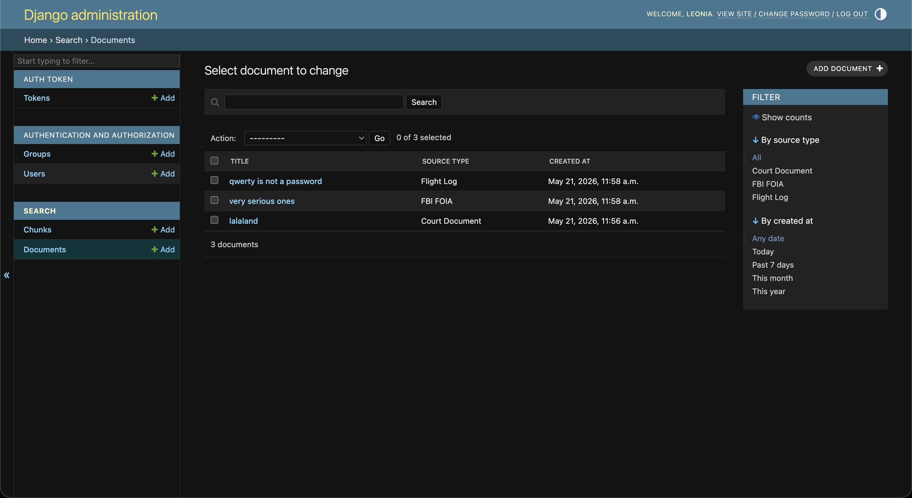

# ragedj

Django + DRF demo project: REST API over a small document corpus, built as a focused learning exercise to demonstrate Django/DRF fluency from a FastAPI background.

## Why this exists

The production version of this concept runs on FastAPI at [ragepsteiner.space](https://ragepsteiner.space) — a paid RAG SaaS over declassified court documents, FBI FOIA files, and handwritten flight logs. This project re-implements the read-side mechanics — models, REST endpoints, auth, admin, tests — in Django + DRF, to demonstrate that the framework transition is mechanical, not conceptual. The AI/RAG layer (pgvector, Claude streaming) is intentionally out of scope here.

## Stack

- Python 3.11+
- Django 5.x
- Django REST Framework 3.15+
- SQLite (zero-config; easy to swap for Postgres)

## Quickstart

```bash
git clone https://github.com/skeletovich/ragedj.git
cd ragedj
python3 -m venv venv
source venv/bin/activate    # Windows: venv\Scripts\activate
pip install -r requirements.txt
python manage.py migrate
python manage.py createsuperuser
python manage.py seed       # optional: loads 3 sample documents with chunks
python manage.py runserver
```

Django admin is live at http://127.0.0.1:8000/admin/ with the superuser credentials.  
API is live at http://127.0.0.1:8000/api/.

## Endpoints

| Method | Path | Auth | Description |
|--------|------|------|-------------|
| GET | `/api/documents/` | open | Paginated list of documents with id, title, source_type, chunk_count |
| GET | `/api/documents/<id>/` | open | Document detail with nested chunks |
| POST | `/api/search/` | Token required | Keyword search over chunks (icontains), capped at 50 results |
| POST | `/api/auth/token/` | open | Issue auth token for given credentials |

## Examples

```bash
# List documents
curl http://127.0.0.1:8000/api/documents/
```

```json
{"count": 3, "next": null, "previous": null, "results": [...]}
```

```bash
# Document detail with nested chunks
curl http://127.0.0.1:8000/api/documents/1/
```

```bash
# Get an auth token (use your superuser credentials)
curl -X POST http://127.0.0.1:8000/api/auth/token/ \
  -H "Content-Type: application/json" \
  -d '{"username": "admin", "password": "yourpassword"}'
```

```json
{"token": "abc123..."}
```

```bash
# Authenticated keyword search
curl -X POST http://127.0.0.1:8000/api/search/ \
  -H "Content-Type: application/json" \
  -H "Authorization: Token abc123..." \
  -d '{"query": "witness"}'
```

```json
{"query": "witness", "total_matches": 3, "returned": 3, "capped_at": 50, "results": [...]}
```

## Admin

Registered both `Document` and `Chunk` with `list_display`, `list_filter`, and `search_fields`. Django ships this as a framework feature; FastAPI has no equivalent without third-party libraries (sqladmin, fastapi-admin). For internal or operator tooling, this is a significant time difference.



## Tests

17 tests covering all endpoints, authentication, validation, pagination, ordering, and result capping. 99% line coverage on the search app.

```bash
python manage.py test search
```

## Architecture notes (FastAPI → Django + DRF)

- DRF serializers are more declarative than Pydantic + manual responses. Less code for response shaping, but `SerializerMethodField` is the escape hatch for anything non-trivial.
- Django admin is a feature; FastAPI has no equivalent without third-party libs. Significant time saved for internal or operator tooling.
- N+1 queries are a real risk in DRF's nested serializers. The list endpoint uses `annotate(_chunk_count=Count("chunks"))` paired with a serializer that reads from the annotation; the search endpoint uses `select_related("document")`. Both confirmed by query count checks in the shell during development.
- Django's ORM and migrations land in roughly the same conceptual space as SQLAlchemy + Alembic — fewer moving parts than the FastAPI stack, but less explicit about what the framework is doing.

## Scope

This is a focused demo, not a feature-complete app. Out of scope: embeddings, vector search, Claude integration, streaming, frontend, Docker, CI/CD, Postgres. The production version at ragepsteiner.space has all of those — this repo deliberately strips them away to keep the focus on Django/DRF mechanics.

## Author

Leon Voznyachuk — https://github.com/skeletovich
